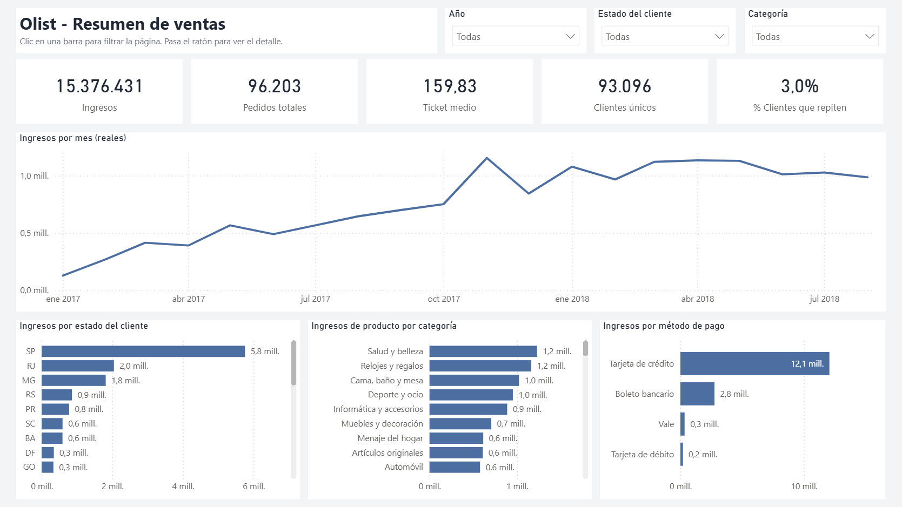

# Olist: por qué los clientes no repiten

Análisis de la cartera de clientes de Olist, un marketplace brasileño, sobre 96.203 pedidos reales de 2017 y 2018. Recorre el ciclo completo: extracción con SQL, limpieza, análisis exploratorio, segmentación, modelo predictivo, cuadro de mando en Power BI e informe ejecutivo.

Proyecto personal de portfolio con el [conjunto de datos público de Olist](https://www.kaggle.com/datasets/olistbr/brazilian-ecommerce). No es un encargo de la compañía.



## La pregunta

> Casi ningún cliente repite compra. ¿Quiénes son los clientes valiosos, por qué no vuelven y qué se puede hacer?

## Lo que salió

| Hallazgo | Cifra |
|---|---|
| Olist funciona como negocio de compra única | El 97 % de los 93.096 clientes compra una sola vez |
| La retención mensual es casi nula | El 0,48 % vuelve al mes siguiente |
| La entrega decide la valoración | 9,2 % de mala nota si llega a tiempo; 78,4 % con más de 7 días de retraso |
| El retraso no lo explica todo | Dos tercios de las malas notas son de pedidos entregados en plazo |
| Los pedidos de varios vendedores son un segundo foco | 47,1 % de mala nota |
| El valor está concentrado | El 18 % de los clientes genera el 49 % de los ingresos |
| Se puede anticipar parte del problema | El 10 % de pedidos con más riesgo según el modelo contiene el 41,6 % de las malas notas |

Las conclusiones y las cinco recomendaciones están en el [informe ejecutivo (PDF)](informe/informe_ejecutivo_olist.pdf).

## Contenido

| Fase | Archivo | Qué hace |
|---|---|---|
| 0. Carga | [scripts/00_cargar_datos.py](scripts/00_cargar_datos.py) | Vuelca los 9 CSV originales a una base de datos SQLite |
| 1. Exploración | [sql/01_exploracion.sql](sql/01_exploracion.sql) | 14 consultas: calidad del dato, ingresos, recompra, retrasos (JOIN, CTE, funciones ventana) |
| 2. Limpieza | [notebooks/02_limpieza.ipynb](notebooks/02_limpieza.ipynb) | Nulos, duplicados, tipos, valores anómalos y registro de cada decisión |
| 3. EDA y KPIs | [notebooks/03_eda_kpis.ipynb](notebooks/03_eda_kpis.ipynb) | Indicadores del negocio y factores asociados a la mala valoración |
| 4. Segmentación | [notebooks/04_segmentacion.ipynb](notebooks/04_segmentacion.ipynb) | RFM, cohortes de retención y K-means |
| 5. Modelo | [notebooks/05_modelo.ipynb](notebooks/05_modelo.ipynb) | Regresión logística y random forest para predecir la mala valoración |
| 6. Cuadro de mando | [dashboard_olist.pbix](dashboard_olist.pbix) | Power BI: 4 páginas interactivas, 21 medidas DAX |
| 7. Informe | [informe/informe_ejecutivo_olist.pdf](informe/informe_ejecutivo_olist.pdf) | Conclusiones y recomendaciones para dirección |

El cuadro de mando también está como proyecto de texto en [powerbi/](powerbi/) (formato PBIP), generado con [scripts/06_generar_powerbi.py](scripts/06_generar_powerbi.py).

## Decisiones de método

- **`customer_unique_id`, no `customer_id`.** Olist genera un `customer_id` nuevo en cada pedido; contando con él, la recompra sale 0 %.
- **Periodo acotado a enero 2017 - agosto 2018.** Los meses de los extremos tienen entre 1 y 324 pedidos y distorsionan la evolución.
- **Los valores extremos reales se conservan.** El 7,9 % de los pedidos, que la regla IQR marcaría como anómalos por importe, suma el 33,7 % de los ingresos. Se marcan con una columna en lugar de borrarlos.
- **RFM adaptado.** Con el 97 % de los clientes en frecuencia 1 no se pueden hacer quintiles de frecuencia; se puntúan recencia y gasto, y la frecuencia se usa como "una compra" o "más de una".
- **Se predice la mala valoración, no el abandono.** Con una recompra del 3 %, un modelo de abandono no tendría sentido.
- **El modelo se mide con precisión, recall y AUC, no con exactitud.** Decir siempre "nota buena" acierta el 87 % sin detectar un solo caso.
- **Las cifras se contrastan entre SQL, pandas y Power BI.** Esa comparación destapó un error en una medida DAX, que contaba los pedidos sin valorar como mala nota.

## Resultados del modelo

| Modelo | Precisión | Recall | AUC |
|---|---|---|---|
| Regresión logística | 0,282 | 0,565 | 0,733 |
| Random forest | 0,403 | 0,510 | 0,753 |
| Random forest, validación temporal | | | 0,698 |

La validación temporal entrena con los pedidos hasta abril de 2018 y evalúa con los de mayo a agosto. Es la cifra realista.

## Limitaciones

- No hay datos de costes ni de márgenes: no se cuantifica el retorno de las recomendaciones.
- Las relaciones descritas son asociaciones, no causas demostradas. La explicación de los pedidos de varios vendedores es una hipótesis.
- El modelo es modesto porque faltan variables clave, como la calidad del producto o el estado del paquete.
- Los datos terminan en 2018.

## Cómo reproducirlo

Requiere Python 3.12. Los datos no se incluyen en el repositorio por tamaño.

```bash
pip install -r requirements.txt
```

1. Descarga los 9 CSV del [dataset de Olist en Kaggle](https://www.kaggle.com/datasets/olistbr/brazilian-ecommerce) y déjalos en `data/raw/`.
2. Crea la base de datos: `python scripts/00_cargar_datos.py`
3. Ejecuta los notebooks en orden, del 02 al 05. El 02 genera las tablas limpias en `data/clean/`.
4. Abre `dashboard_olist.pbix` con Power BI Desktop. Para actualizar los datos, cambia el parámetro `RutaDatos` (Transformar datos → Administrar parámetros) a la ruta de tu carpeta `data/clean/`.

## Herramientas

SQL (SQLite) · Python (pandas, scikit-learn, matplotlib) · Power BI (DAX, Power Query) · Word

## Autor

Miguel Martín-Caro
